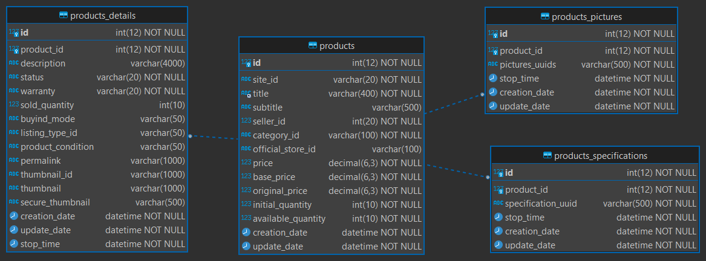

# Microdb_MercadoLibre_Productos_Mysql
Micro Base de Datos acerca de Productos, replicando y modificando parte de la arquitectura de datos de ML.

* [Repositorio Microservice_Mercadolibre_Products_AWS](https://github.com/andresWeitzel/Microservice_Mercadolibre_Products_AWS)
* Api Doc ML Categorías 
  * [Productos](https://developers.mercadolibre.com.ar/es_ar/publica-productos) 

